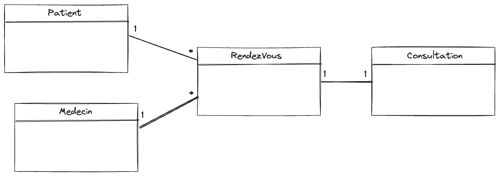

## Introduction
Toute application moderne est complexe et nécessite une architecture logicielle bien pensée pour être maintenable et évolutive. La logique métier de l'application doit être le focus plutôt que la logique de l'implémentation.

## Énoncé
Ce TP consiste à mettre en œuvre une application de gestion d'un hopital. On utilisera des libraries tierces pour la gestion de la persistance des données et pour l'abstraction du code d'implémentation. On utilisera:
- Hibernate pour la gestion de la persistance des données
- Spring Data JPA pour l'abstraction du code d'implémentation
- JPA pour la gestion des entités
- H2 Database pour la base de données

## Conception


## Code Source
### Entités
```java
@Entity
@Data @NoArgsConstructor @AllArgsConstructor @Setter @Getter
public class Patient {
    @Id @GeneratedValue(strategy = GenerationType.IDENTITY)
    private Long id;
    @Temporal(TemporalType.DATE)
    private Date birthDay;
    private String name;
    private boolean sick;
    @OneToMany (mappedBy = "patient", fetch = FetchType.LAZY)
    private Collection<RendezVous> rendezVous;
}
```

```java
@Entity
@Data @NoArgsConstructor @AllArgsConstructor @Setter @Getter
public class RendezVous {
    @Id
    @GeneratedValue (strategy = GenerationType.IDENTITY)
    private Long id;
    @Temporal(TemporalType.DATE)
    private Date date;
    private boolean cancelled;
    @ManyToOne
    private Patient patient;
    @ManyToOne
    private Medecin medecin;
    @OneToOne(mappedBy = "rendezVous")
    private Consultation consultation;
}
```

```java
@Entity
@Data @AllArgsConstructor @NoArgsConstructor @Setter @Getter
public class Medecin {
    @Id
    @GeneratedValue(strategy = GenerationType.IDENTITY)
    private Long id;
    private String name;
    private String email;
    private String specialization;
    @OneToMany(mappedBy = "medecin", fetch = FetchType.LAZY)
    private Collection<RendezVous> rendezVous;
}
```

```java
@Entity
@Data @AllArgsConstructor @NoArgsConstructor @Setter @Getter
public class Consultation {
    @Id
    @GeneratedValue(strategy = GenerationType.IDENTITY)
    private Long id;
    private String diagnostic;
    private String prescription;
    @OneToOne
    private RendezVous rendezVous;
}
```

### Repositories
```java
public interface ConsultationRepository extends JpaRepository<Consultation, Long> {}
public interface MedecinRepository extends JpaRepository<Consultation, Long> {}
public interface PatientRepository extends JpaRepository<Consultation, Long> {}
public interface RendezVousRepository extends JpaRepository<Consultation, Long> {}
```

### Intégration avec Base de Données
#### H2 Database
```properties
spring.datasource.url=jdbc:h2:mem:patients
spring.datasource.username = root
spring.datasource.password =
```
#### MySQL
```properties
spring.datasource.url=jdbc:mysql://localhost:3306/hospital?createDatabaseIfNotExist=true
spring.datasource.username = root
spring.datasource.password = root
```


